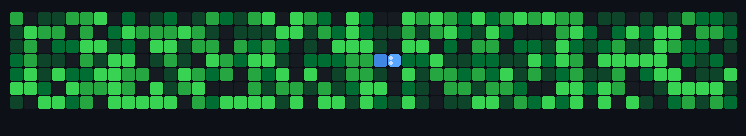

<div align="center">


<br/>

[](https://linkedin.com/in/jholmm)
[](https://github.com)
[](https://funiber.org)
[](https://github.com)

</div>

<br/>

---

### 👤 whoami

```yaml
name:     Jhol Moreira Mendanha
role:     Software Engineer · Project Manager · Founder
company:  Urban Code Labs
study:    MSc Strategic Direction in Software Engineering @ FUNIBER
base:     Goiânia, GO, Brasil 🇧🇷
exp:      16+ years — PT · Softtek · Cast Group · internacional
```

> *"Low-code removes friction. High-code removes limits. The best engineer knows when to use each."*

---

### 🛠️ Tech Stack

<div align="center">

**Platform & Low-code**

[](https://outsystems.com)
[](https://outsystems.com)

**Backend**

[](https://python.org)
[](https://java.com)
[](https://github.com)

**Frontend**

[](https://developer.mozilla.org)
[](https://react.dev)
[](https://preactjs.com)
[](https://developer.mozilla.org)
[](https://developer.mozilla.org)

**Mobile**

[](https://swift.org)
[](https://developer.apple.com/swiftui)
[](https://kotlinlang.org)

**Process & Tools**

[](https://git-scm.com)
[](https://azure.microsoft.com)
[](https://scrumalliance.org)
[](https://pmi.org)
[](https://github.com)
[](https://glpi-project.org)

</div>

---

### 📅 Experience

```
● 2024–now   PM & Tech Lead · Prefeitura de Goiânia
             OutSystems Reactive · GLPI · ITSM · Gestão de contratos

● 2022–now   Founder · Urban Code Labs
             Gestão de projetos · Dev

● 2020–now   OutSystems Specialist
             Reactive Web · REST integrations · Custom components

● 2008–2024  IT Engineer & PM · PT · Softtek · Cast Group
             Portugal 🇵🇹 · Espanha 🇪🇸 · Brasil 🇧🇷 · 16y experience
```

---

### 🗂️ Projects

| # | Project | Stack | Status |
|---|---------|-------|--------|
| 01 | 📊 MeusIndicadores Dashboard | OutSystems 11 Reactive | 🟡 WIP |
| 02 | 🎫 E-ATENDE Service Desk | HTML · CSS · JS | ✅ Done |
| 03 | 🏛️ SAC — Portal do Cidadão | Requirements · SRS | ✅ Done |
| 04 | 🔌 GLPI API Extractor | Python · REST | ✅ Done |

---

<div align="center">



<br/>

`Building things that matter, one commit at a time.`

<br/>


</div>
