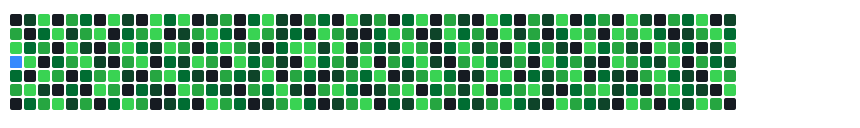

<!-- Banner / Header -->
<div align="center">

```
╔══════════════════════════════════════════════════════════╗
║   Building things that matter. Low-code speed,          ║
║   high-code precision. Always shipping.                  ║
╚══════════════════════════════════════════════════════════╝
```

# Jhol Moreira Mendanha

**`Software Engineer · PM · Founder · Low-code Wizard`**

[](https://linkedin.com)
[](https://github.com)
[](https://github.com)

</div>

---

## `> whoami`

```python
class Jhol:
    name        = "Jhol Moreira Mendanha"
    role        = ["Software Engineer", "Project Manager", "Founder"]
    location    = "Goiânia, GO 🇧🇷"
    company     = "Urban Code Labs"
    
    education = {
        "master"  : "Strategic Direction in Software Engineering — FUNIBER 🎓",
        "degree"  : "Systems Analysis",
        "mba"     : "Project Management",
    }
    
    currently = [
        "Building OutSystems reactive apps for Goiânia city hall 🏛️",
        "Completing my international master's degree 📚",
        "Scaling Urban Code Labs 🚀",
    ]
    
    fun_fact = "I speak fluent OutSystems, decent Python, and broken Swift. My bug tracker is my to-do list."
```

---

## `> tech --stack`

<div align="center">

### ⚡ Low-code / Enterprise


### 🐍 Backend & Scripting


### 🌐 Frontend


### 🍎 Mobile


### 🛠️ Tools & Process


</div>

---

## `> git log --oneline --experience`

```
15y ago  feat: started career in IT & telecom
   ...   feat: Portugal Telecom, Softtek, Cast Group — international exp 🌍
   ...   feat: moved into project management & IT governance
  4y ago  feat: went deep on OutSystems low-code development
  2y ago  feat: founded Urban Code Labs 🏢
  now     feat: PM + Tech Lead at Prefeitura de Goiânia contracts
  now     wip:  master's degree in Strategic Direction @ FUNIBER
  now     wip:  always building, always shipping 🚀
```

---

## `> ls -la /projects`

| Project | Stack | Status |
|---|---|---|
| 🏛️ MeusIndicadores Dashboard | OutSystems 11 Reactive | 🟡 In Progress |
| 🎫 E-ATENDE Service Desk | HTML / CSS / JS | ✅ Delivered |
| 📋 SIGOF — Sistema de Gestão Financeira | SRS / IEEE 830 | ✅ Delivered |
| 📊 SAC — Portal do Cidadão | SRS / Requirements | ✅ Delivered |
| 🔌 GLPI API Data Extractor | Python | ✅ Delivered |
| 🏢 Urban Code Labs | Everything | 🔄 Ongoing |

---

## `> cat /stats/github`

<div align="center">


</div>

---

## `> cat /philosophy/quote.txt`

<div align="center">

> *"Low-code removes friction. High-code removes limits.*
> *The best engineer knows when to use each."*
>
> — Jhol Moreira

</div>

---

## `> traceroute /contact`

<div align="center">

💼 **Gerente de Projetos** · Contrato Prefeitura de Goiânia  
🏢 **Fundador** · Urban Code Labs  
🎓 **Mestrando** · Direção Estratégica em Eng. de Software — FUNIBER  
📍 **Goiânia, Goiás, Brasil**

---

*"Code is craft. Delivery is discipline. Impact is the goal."*

</div>

---

<!-- Snake animation -->
<div align="center">

### contributions



</div>

<!-- Footer -->
<div align="center">

</div>
