<div align="center">



<br/>

[](https://linkedin.com/in/SEU_PERFIL)
[](https://github.com)
[](https://funiber.org)
[](https://github.com)

</div>

<br/>

---

### 👤 whoami

```yaml
name:     Jhol Moreira Mendanha
role:     Software Engineer · Project Manager · Founder
company:  Urban Code Labs
contract: Prefeitura de Goiânia — IT (PM + Tech Lead)
study:    MSc Strategic Direction in Software Engineering @ FUNIBER
base:     Goiânia, GO, Brasil 🇧🇷
exp:      15+ years — PT · Softtek · Cast Group · internacional
```

> *"Low-code removes friction. High-code removes limits. The best engineer knows when to use each."*

---

### 🛠️ Tech Stack

<div align="center">

**Platform & Low-code**

[](https://outsystems.com)
[](https://outsystems.com)

**Backend**

[](https://python.org)
[](https://github.com)

**Frontend**

[](https://developer.mozilla.org)
[](https://react.dev)
[](https://developer.mozilla.org)
[](https://developer.mozilla.org)

**Mobile**

[](https://swift.org)
[](https://developer.apple.com/swiftui)

**Process & Tools**

[](https://git-scm.com)
[](https://azure.microsoft.com)
[](https://github.com)
[](https://glpi-project.org)

</div>

---

### 🚧 Currently Building & Learning

```
┌─────────────────────────────────────────────────────────────┐
│  BUILDING                                                   │
├─────────────────────────────────────────────────────────────┤
│                                                             │
│  📊 MeusIndicadores Dashboard                               │
│     OutSystems 11 Reactive · Custom chart components        │
│     HorizontalBar · Radar · SavingChart · Gauge             │
│     [██████████░░░░░░]  65%                                 │
│                                                             │
│  🏢 Urban Code Labs                                         │
│     Growing the company, landing new contracts              │
│     [████████████████]  ongoing                             │
│                                                             │
│  🎓 MSc @ FUNIBER                                          │
│     Direção Estratégica em Engenharia de Software           │
│     [████████████░░░░]  wrap-up fim de 2026                 │
│                                                             │
├─────────────────────────────────────────────────────────────┤
│  LEARNING                                                   │
├─────────────────────────────────────────────────────────────┤
│                                                             │
│  🍎  SwiftUI — going deeper on iOS dev                     │
│  ⚛️   React advanced patterns + hooks                       │
│  🤖  AI agents — Anthropic API integration                  │
│  🏗️   High-code to complement low-code expertise            │
│                                                             │
└─────────────────────────────────────────────────────────────┘
```

---

### 📈 GitHub Stats

<div align="center">


</div>

---

### 🗂️ Projects

| # | Project | Stack | Status |
|---|---------|-------|--------|
| 01 | 📊 MeusIndicadores Dashboard | OutSystems 11 Reactive | 🟡 WIP |
| 02 | 🎫 E-ATENDE Service Desk | HTML · CSS · JS | ✅ Done |
| 03 | 📋 SIGOF — Gestão Financeira Municipal | SRS · IEEE 830 | ✅ Done |
| 04 | 🏛️ SAC — Portal do Cidadão | Requirements · SRS | ✅ Done |
| 05 | 🔌 GLPI API Extractor | Python · REST | ✅ Done |
| 06 | 📄 OS Generator — Ordens de Serviço | Python · ReportLab | ✅ Done |

---

### 📅 Experience

```
● 2024–now   PM & Tech Lead · Prefeitura de Goiânia
             OutSystems Reactive · GLPI · ITSM · Gestão de contratos

● 2022–now   Founder · Urban Code Labs
             Low-code consulting · Gestão de projetos · Dev

● 2020–now   OutSystems Specialist
             Reactive Web · REST integrations · Custom components

● 2010–2020  IT Engineer & PM · PT · Softtek · Cast Group
             Portugal 🇵🇹 · Espanha 🇪🇸 · Brasil 🇧🇷 · 15y experience
```

---

<div align="center">


<br/>

`Building things that matter, one commit at a time.`

<br/>


</div>
